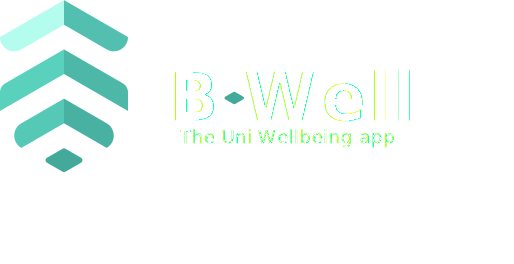

# B-Well

A daily wellbeing tracking web app for University of Birmingham students. Students log short daily check-ins across five dimensions (stress, sleep, social, academic, activity) and view their trends over time.

<p align="center">
  
</p>

<p align="center">
  <em>Daily wellbeing tracking for University of Birmingham students.</em>
</p>

---

## Preview

<p align="center">
  
</p>

## Features
...


## Features

- University-email-gated registration (`@student.bham.ac.uk` / `@bham.ac.uk`)
- Secure login/logout via Flask-Login with hashed passwords
- Daily wellbeing check-in (5 metrics on a 1–5 scale + optional notes)
- Daily check-in per day rule enforced in-app
- Historical visualisation with Chart.js; switch between metrics to view trends
- Automatic daily reminder notifications (via APScheduler)
- Persistent SQLite storage

## Tech stack

| Layer | Library |
|---|---|
| Web framework | Flask |
| ORM | Flask-SQLAlchemy |
| Auth | Flask-Login |
| Forms | Flask-WTF / WTForms |
| Background jobs | APScheduler |
| Database | SQLite |
| Charts | Chart.js (CDN) |

## Project structure

```
B-Well/
├── app/
│   ├── __init__.py       # Flask app, DB, login manager, scheduler startup
│   ├── models.py         # User, WellbeingResponse, Notification, Resource
│   ├── forms.py          # Registration, Login, Wellbeing forms + validators
│   ├── routes.py         # All route handlers
│   ├── scheduler.py      # Daily notification background job
│   └── templates/        # Jinja2 templates (base, index, login, registration,
│                         #   wellbeing_form, score, tracking)
├── config.py             # Flask configuration
├── requirements.txt      # Python dependencies
└── app.db                # SQLite database
```

## Getting started

### Prerequisites
- Python 3.11+
- `pip`

### Installation

```bash
# 1. Clone the repo
git clone <repo-url>
cd B-Well

# 2. Create and activate a virtual environment
python -m venv .venv
# Windows
.venv\Scripts\activate
# macOS / Linux
source .venv/bin/activate

# 3. Install dependencies
pip install -r requirements.txt
```

### Configuration

Set environment variables (optional — sensible defaults exist):

```bash
# Windows (PowerShell)
$env:SECRET_KEY="your-secret-key"
$env:DATABASE_URL="sqlite:///app.db"

# macOS / Linux
export SECRET_KEY="your-secret-key"
export DATABASE_URL="sqlite:///app.db"
```

### Running the app

```bash
# Windows
set FLASK_APP=app
flask run

# macOS / Linux
export FLASK_APP=app
flask run
```

Then open <http://127.0.0.1:5000> in your browser.

## Usage

1. Visit `/registration` and create an account with your University of Birmingham email.
2. Log in at `/login`.
3. Submit your daily check-in at `/wellbeing` — rate each of stress, sleep, social, academic, and activity from 1 to 5, add optional notes, and submit.
4. View your overall score on the confirmation page.
5. Visit `/tracking` to see your history charted over time; use the dropdown to switch metrics.

## Data model

- **User** — account details, hashed password, owns responses and notifications.
- **WellbeingResponse** — one check-in per student per day: stress, sleep, social, academic, activity, notes, date.
- **Notification** — in-app reminders, generated on a schedule.
- **Resource** — reserved for future wellbeing resource library.

## Validation rules

- Email must end in `@student.bham.ac.uk` or `@bham.ac.uk`
- Password must be at least 8 characters and contain at least one digit
- All five wellbeing metrics must be integers between 1 and 5
- Users must consent to data collection to register
- A student can only submit one check-in per calendar day

## Documentation

Documentation will be submitted to the repository on submission of Course Work

## License

This is a piece of University Coursework
